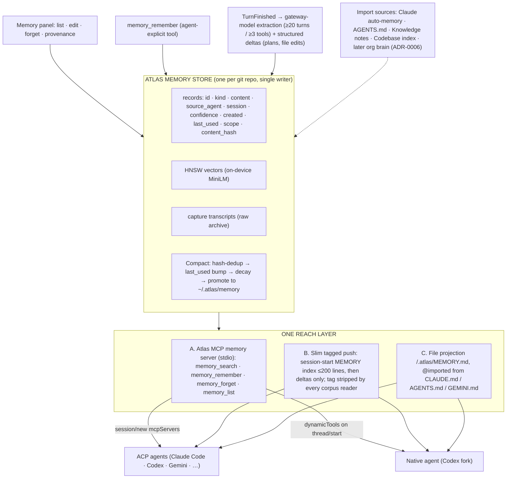

# How does Atlas's shared memory system work today, and how should it become one memory for every agent?

**Question.** Atlas runs a native agent (the Codex fork, "Atlas Agent") and any
number of ACP agents (Claude Code, Codex CLI, Gemini CLI, …). Each is a
separate process with its own context window. What does Atlas currently do to
give them shared, persistent memory, where does that memory live, who writes
and reads it, and what would a single unified memory look like?

Researched 2026-09-16 on branch `0.3.3` against primary sources only: the
source of `atlas`, the vendored engine at `vendor/codex`, and the official
docs of Claude Code, Gemini CLI and ACP. Every claim carries a `path:line` or
a URL. A live sample of the injected prompt (captured during this session) is
used as evidence in §8.

---

## 1. Summary

- Atlas has **no single memory store**. It has six app-owned stores on disk,
  three foreign stores it reads, and one unused store inside the engine (§2).
- Memory reaches agents by **prompt push** for everyone and by **tool pull**
  for the native agent only. ACP agents get zero tools and an empty MCP list
  (§3). That asymmetry is the core problem.
- The push path prepends up to four delimited blocks to the user's message on
  every turn (`--- SHARED MEMORY ---`, `--- RELEVANT PROJECT MEMORY ---`,
  `--- PROJECT MEMORY ---`, `--- RECENT SESSION ---`) (§3.1).
- Writes come from three uncoordinated mechanisms: a keyword pass over
  deltas, a legacy per-turn BYOK distill, and a gated BYOK session
  extraction behind an env flag that defaults off. **On a fresh install with
  no BYOK key, no LLM ever distills anything** (§6).
- Injected blocks leak back into agents' own memory files and get
  re-injected, which the live sample proves (§8, gap 2).
- The "company brain" of ADR-0006 has no code; `atlas-kb-server` is a static
  export viewer (§4).
- Every external tool solves this with a file convention plus optional MCP;
  ACP itself has no memory primitive, only `mcpServers` on `session/new` (§7).

## 2. Inventory of stores

| # | Store | Owner | Location | Format | Readers | Writers |
|---|-------|-------|----------|--------|---------|---------|
| 1 | **Memory engine** (vectors + graph + memdir) | `crates/atlas-memory` | `<project>/.atlas/memory/` → `manifest.json`, `hnsw.usearch`, `docstore.json`, `graph/` (grafeo), `extracted/<session>.md` (`crates/atlas-memory/src/lib.rs:150-166`, `extract.rs:20-24`) | usearch HNSW + JSON side maps + embedded graph DB + markdown memdir | `memory_retrieve::retrieve` (`src-tauri/src/commands/memory_retrieve.rs:50`), native `search_memory` (`src-tauri/src/commands/agents.rs:809`), Memory ▸ Graph | `MemoryIndexer` jobs `IndexCorpus` / `ExtractSession` / `Compact` (`src-tauri/src/commands/memory_indexer.rs:49-59`) |
| 2 | **Shared cross-agent event log** | `src-tauri/.../shared_memory.rs` | `<project>/.atlas/shared-memory/events.jsonl` + `state.json` (`shared_memory.rs:1-9`) | append-only typed `RawEvent`s (`EventKind`: PlanSet, Decision, FileChanged, Fact, Failure, Architecture, SessionStart/End, TodoAdded/Done; `shared_memory.rs:47-71`) folded into a bounded state view (50/50/50/30/30 caps, `:35-39`) | `memory_inject::build_shared_block`, Memory ▸ Shared tab, `read_shared_memory_docs` (`agent_memory.rs:455`) | `memory_delta::ingest` from every delta (`agents.rs:425-432`), `memory_compile` (BYOK) |
| 3 | **Codebase index** | `codebase_index.rs` | `<project>/.atlas/codebase-index/docs.json` (`codebase_index.rs:1-13`) | per-file structure docs (tree-sitter) + optional LLM summaries | `collect_corpus` (`agent_memory.rs:138` + tail) | `codebase_index_build` command |
| 4 | **Knowledge base notes** | `knowledge.rs` | `<project>/.atlas/knowledge/` | markdown notes, covers, editor state | `read_knowledge_docs` (`agent_memory.rs:388`), Knowledge panel | user via Knowledge panel |
| 5 | **Sharing settings** | `memory_sharing.rs` | `<project>/.atlas/memory-sharing.json`, `memory-summarizer.json` (`memory_sharing.rs:73-78`) | JSON; sharing defaults **on** (`:34`) | `agents_send` | Memory ▸ Sharing controls |
| 6 | **Global memory** | `atlas-memory/src/global.rs` | `~/.atlas/memory/` → `global-graph/`, `MEMORY.md` (<200 lines), `global-candidates.json` (`global.rs:17-25`) | graph + markdown + JSON ledger | `retrieve.rs:283` blend when local memory is sparse | `consolidate.rs:141` promotion (preference/constraint, confidence ≥0.8, seen in ≥2 projects; `global.rs:9-14`) |
| 7 | **Session capture** | `atlas-checkpoint` via `capture.rs` | per-Workspace store (`capture.rs:1-6`) | app-owned transcripts for **every** agent (`agents.rs:283-292`) | `read_capture_docs` (`agent_memory.rs:312`), past-session `@`-mentions, handoff | `OutboundPipeline` stage on every delta |
| 8 | *(legacy)* flat vector index | `memory_graph.rs` | `<project>/.atlas/memory-index/index.json` (`memory_graph.rs:109-113`) | JSON blob | migrated once by `migrate.rs` | nothing new; path still referenced |
| F1 | *(foreign, read-only)* Claude Code memory | Claude Code | `~/.claude/projects/<encoded-cwd>/memory/*.md` + `MEMORY.md`, `./CLAUDE.md`, `~/.claude/CLAUDE.md` (`agent_memory.rs:4-7`, `collect_corpus`) | markdown with YAML frontmatter | corpus, Memory ▸ Policy (`memory_policy.rs:1-8`) | Claude Code itself |
| F2 | *(foreign, read-only)* Codex CLI | Codex CLI | `~/.codex/state_*.sqlite` threads by cwd, `./AGENTS.md` (`agent_memory.rs:7-10`) | SQLite + markdown | corpus, Memory panel thread list (flagged in `CONTEXT.md:22`) | Codex CLI itself |
| F3 | *(engine, dormant)* Codex-fork memories | `vendor/codex/memories/{read,write}` | `<engine home>/memories` (`vendor/codex/memories/read/src/lib.rs:13-15`) | startup extraction pipeline from rollouts, phase 1/2 prompts (`memories/write/src/lib.rs:1-5`) | the fork, if enabled | the fork, if enabled. Feature key `memories` is `Stable` but `default_enabled: false` (`vendor/codex/features/src/lib.rs:951-955`); `use_memories` defaults true (`vendor/codex/config/src/types.rs:344`) but is ANDed with the feature (`core/src/config/mod.rs:3929`). Atlas's overrides never touch it (`crates/atlas-native-agent/src/engine/config.rs:307-328`) → **off** |

`read_cersei_docs` is a stub returning nothing (`agent_memory.rs:444-446`).

Code volume for the surface: ~5.7k lines of Tauri commands, ~6.0k lines across
`atlas-memory`/`atlas-embed`/`atlas-codeindex`, ~10.5k lines of frontend under
`src/features/memory` and `src/features/knowledge`.

## 3. Data flow per agent kind

```mermaid
flowchart LR
  subgraph Foreign["Foreign stores (read-only)"]
    CM["~/.claude/projects/*/memory + CLAUDE.md"]
    CX["~/.codex/state_*.sqlite + AGENTS.md"]
  end
  subgraph Atlas["App-owned stores  <project>/.atlas/"]
    EV["shared-memory/events.jsonl + state.json"]
    ME["memory/ (HNSW + docstore + graph + extracted/*.md)"]
    CI["codebase-index/docs.json"]
    KB["knowledge/"]
    CAP["capture (transcripts, every agent)"]
  end
  GL["~/.atlas/memory (global promoted)"]

  CM & CX & CI & KB & CAP & EV -->|collect_corpus| ME
  ME -->|consolidate → promote| GL
  GL -.->|blend when sparse| ME

  subgraph Write["Write triggers (TauriDeltaSink::emit)"]
    D1["memory_delta::ingest (plan / file edits / marker phrases)"] --> EV
    D2["TurnFinished → memory_compile (BYOK, default)"] --> EV
    D3["TurnFinished → Job::ExtractSession (BYOK, env flag OFF)"] --> ME
    D4["TurnFinished → enqueue_index"] --> ME
  end

  subgraph Send["agents_send (all sessions)"]
    B1["--- SHARED MEMORY --- (delta by sync clock)"]
    B2["--- RELEVANT PROJECT MEMORY --- (RAG top-3)"]
    B3["--- PROJECT MEMORY --- + --- RECENT SESSION --- (first send)"]
  end
  EV --> B1
  ME --> B2
  ME & CAP --> B3
  B1 & B2 & B3 -->|prepended to user text| NA["Native agent (Codex fork)"]
  B1 & B2 & B3 -->|prepended to user text| ACP["ACP agents"]
  ME -->|search_memory dynamic tool| NA
  ACP -.->|mcpServers = [] · no tool| X["(no pull path)"]
```

### 3.1 The push path (both kinds)

Native and ACP sessions share one `AgentHost`; the native agent is just the
always-present entry (`src-tauri/src/commands/agent_host.rs:25-48,311-323`).
So `agents_send` applies identically to both (`agents.rs:1240-1425`):

1. Bare send if no cwd or sharing disabled (`:1333-1340`). Slash-command turns
   also ship bare so Claude Code still resolves `/skill` at byte 0
   (`:1349-1360`).
2. `--- SHARED MEMORY ---`: `memory_inject::build_shared_block` gated by a
   per-session sync clock; first sync = full state, later turns = delta only
   (`memory_inject.rs:1-14`, `agents.rs:1366-1369`).
3. `--- RELEVANT PROJECT MEMORY ---`: RAG the engine with the user's text,
   top-3, dedup against docs already injected this session, 320 chars/doc,
   1400 chars total, 6 s hard cap (`memory_retrieve.rs:26-31`,
   `agents.rs:1371-1395`).
4. First send only: `--- PROJECT MEMORY ---` curated pack + `--- RECENT
   SESSION ---` handoff (tail of the most recent *other Claude* session,
   optionally BYOK-summarised), 8 s budget (`memory_pack.rs:1-15`,
   `agents.rs:1229-1231,1397-1405,1431-1490`).
5. All blocks are joined and prepended to the user text (`:1408-1425`).
   Session capture records the *raw* text, not the prefixed one
   (`:1290-1293`); `atlas-agent-transcript` strips `--- X --- … --- END X ---`
   spans when reading transcripts back (`crates/atlas-agent-transcript/src/lib.rs:104-107`).

### 3.2 The pull path (native only)

The fork exposes a `search_memory` dynamic tool declared on `thread/start` and
served back over `item/tool/call`; retrieval is injected as a callback
(`crates/atlas-native-agent/src/engine/memory.rs:1-33`). The app registers it
at `agents.rs:809` over `memory_retrieve::retrieve`. ACP agents get nothing:
`session/new` is sent with `mcp_servers = Vec::new()`
(`crates/atlas-agent-servers/src/connection.rs:854`) and Atlas advertises no
memory tool.

## 4. kb-server / company brain

- ADR-0006 is a one-paragraph intent (consent-based operating record from
  Slack `#team`, Linear, GitHub, PostHog; DMs excluded)
  (`docs/adr/0006-consent-based-company-brain.md`). No code references it.
- `atlas-kb-server` is a single-binary static file server for an **exported**
  knowledge base: embeds HTML at build time, picks a port (default 4747),
  opens a browser (`crates/atlas-kb-server/src/main.rs:1-12`). It is built on
  demand by `knowledge_export.rs:257-303`. It is not a shared brain, has no
  API, no auth, no sync.
- There is no org/user-scoped remote memory anywhere in the app.

## 5. Frontend surfaces and command wiring

Memory panel tabs: `graph`, `policy`, `timeline`, `shared`
(`src/features/memory/components/memory-panel.tsx:36-55`), plus
`memory-sharing-controls.tsx`, `memory-tree-view.tsx`, `provider-pickers.tsx`.
Knowledge is a separate feature (`src/features/knowledge/components/`, 12
files: tree, finder, graph, inspector, editor).

Registered memory-family commands in `src-tauri/src/lib.rs`: 57. Frontend
`invoke(...)` names: 379. Registered but never invoked by the frontend:

| Command | Status |
|---------|--------|
| `import_into_knowledge` | dead |
| `knowledge_export_server` | dead |

Everything else is wired. `memory_compile` carries `TODO(step8): remove`
(`agents.rs:456`).

## 6. Lifecycle and scoping

**When memory is written**

| Trigger | Mechanism | Gate | Target |
|---------|-----------|------|--------|
| every delta | `memory_delta::ingest`: `PlanUpdated`, `ToolCallUpserted` file edits, and a marker-phrase pass ("decided to", "note:", "failed:", … `memory_delta.rs:26-30`) | none | events.jsonl |
| `TurnFinished` (default) | `memory_compile::compile_finished_turn` prose→events via BYOK summariser | **no-op unless** project summariser `mode: "provider"` (`memory_compile.rs:11-14`) | events.jsonl |
| `TurnFinished` (`ATLAS_NATIVE_EXTRACTION=1`) | `Job::ExtractSession` → `extract_and_store`: ≥20 turns, ≥3 tool calls since last extraction (`crates/atlas-memory/src/extract.rs:8-12`) | same BYOK gate (`memory_indexer.rs:518-530`) | graph + `extracted/<session>.md` |
| `TurnFinished` (always) | `enqueue_index` re-embeds the corpus (`agents.rs:466-471`); FS watcher on `*.md`/`docs.json` with ~2 s debounce (`memory_indexer.rs:16-19`) | none | HNSW |
| first open, then idle | `Job::Compact` → `consolidate`: prune `extracted/*.md` by confidence floor + cap, promote to global (`consolidate.rs:1-30`) | none | memdir, `~/.atlas/memory` |
| user action | Knowledge notes, Policy edits (rewrite Claude's memory file span in place, `memory_policy.rs:1-6`) | none | knowledge/, foreign files |

**Dedup.** Manifest content-hash per doc for incremental embedding
(`manifest.rs:4-7`); Jaccard near-dup on retrieval (`retrieve.rs:15-16`);
global promotion keyed by `content_hash` (`global.rs:20-23`). No dedup across
events.jsonl vs memdir vs graph.

**Decay/eviction.** Bounded state view caps (§2 row 2); memdir prune by
confidence + newest-first cap. Graph nodes are never deleted because the
grafeo wrapper exposes no delete and returns content only, no id/confidence
(`consolidate.rs:12-21`).

**Scope.** Everything is keyed by the literal `cwd` string
(`MemoryRegistry`: `cwd → Arc<RwLock<MemoryEngine>>`, `memory_indexer.rs:6`).
Two worktrees or a subdirectory launch get separate memory. Global scope is
per-user machine. No org scope.

**Redaction.** `memory_delta::redact` is a local token heuristic
(`looks_secret`, `memory_delta.rs:174-180`); `atlas-redact` is not used on this
path.

## 7. External comparison

| Tool | Mechanism to receive shared context | Own persistent memory | Source |
|------|-------------------------------------|-----------------------|--------|
| Claude Code | `CLAUDE.md` hierarchy: managed → `~/.claude/CLAUDE.md` → `./CLAUDE.md` / `./.claude/CLAUDE.md` → `CLAUDE.local.md`; `@path` imports (depth 4); `.claude/rules/*.md` with `paths:` scoping; subdirectory files load on demand | **Auto memory** at `~/.claude/projects/<project>/memory/` (project derived from git repo, shared across worktrees); `MEMORY.md` index, first 200 lines / 25 KB loaded every session; topic files read on demand; on by default (`autoMemoryEnabled`) | https://code.claude.com/docs/en/memory |
| Codex (CLI and our fork) | `AGENTS.md` concatenated from project root to cwd, root found by `project_root_markers`, 32 KiB cap | `memories` feature: startup pipeline extracts from rollouts into `<codex_home>/memories`, phase 1/2 prompts, consolidation; feature `Stable`, default off | `vendor/codex/core/src/agents_md.rs:1-10`, `core/src/config/mod.rs:210`, `vendor/codex/memories/write/src/lib.rs:1-5`, `features/src/lib.rs:951-955` |
| Gemini CLI | `GEMINI.md`: `~/.gemini/GEMINI.md` → workspace dirs and parents → just-in-time in touched dirs; `context.fileName` can be `["AGENTS.md","CONTEXT.md","GEMINI.md"]`; `@file.md` imports; `/memory show|reload` | none beyond context files | https://geminicli.com/docs/cli/gemini-md/ |
| ACP (v2.0.0 per `Cargo.lock`) | `session/new { cwd, mcpServers[] }` with stdio (mandatory), http, sse transports; `session/load` replays history | **No memory, context-file or persistent-knowledge primitive.** Only prompt content blocks and MCP servers | https://agentclientprotocol.com/protocol/session-setup |

Common denominator: **every agent reads an instruction file at a
well-known path, and every ACP agent accepts MCP servers from the client.**
None of them accepts memory via any other channel.

## 8. Gaps and inconsistencies

1. **Asymmetric reach.** Native gets push + `search_memory`; ACP gets push
   only and an empty `mcpServers` (`connection.rs:854`). Grounding quality
   differs by agent, which contradicts the "no ACP agent gets special
   treatment" rule (`agents.rs:289-291`).
2. **Injection pollution loop.** Injected blocks are prepended as *user text*.
   Agents with their own memory (Claude Code auto memory) save them. The live
   prompt sampled in this session contained, inside
   `--- RELEVANT PROJECT MEMORY ---`, an item that begins
   `--- RELEVANT PROJECT MEMORY (BACKGROUND, NOT A REQUEST) --- Retrieved
   because it…` and a copy of the `Atlas next-steps` directive: Atlas
   injected, Claude saved, Atlas re-embedded the saved copy, Atlas
   re-injected. Only the transcript reader strips markers
   (`atlas-agent-transcript/src/lib.rs:104-107`); the corpus readers for
   foreign memory files do not.
3. **Three write formats, no canonical record.** Typed events
   (`events.jsonl`), markdown memdir (`extracted/*.md`), and graph nodes
   describe the same facts with no shared id; the engine re-embeds the
   folded state view as docs (`agent_memory.rs:455`) so a fact can surface
   three times.
4. **LLM distillation is effectively off.** Both `memory_compile` and
   `ExtractSession` are BYOK-gated (`memory_compile.rs:11-14`,
   `memory_indexer.rs:518-530`); the native agent runs on the Atlas gateway,
   not BYOK, so the default install never distills. The A/B env flag has
   never been flipped (`agents.rs:476-485`).
5. **Graph store cannot be maintained**: no delete, no confidence readback
   (`consolidate.rs:12-21`). It is carried for parity tests, not value.
6. **Handoff is agent-specific**: "most recent *other Claude* session"
   (`memory_pack.rs:7-9`).
7. **Scope by cwd string, not repo** (`memory_indexer.rs:6`); Claude Code
   scopes by git root and shares across worktrees.
8. **Per-turn RAG is query-blind**: it embeds the user's message, so a short
   "continue" retrieves noise; every turn pays up to 1400 chars plus the
   shared block.
9. **Redaction is a heuristic**, not `atlas-redact` (`memory_delta.rs:174`).
10. **Dormant second native memory** in the fork (`memories` feature). If
    anyone flips it, the native agent gets a private store Atlas never sees.
11. **Company brain / kb-server**: ADR only; kb-server is an export viewer.
12. **Dead or legacy**: `import_into_knowledge`, `knowledge_export_server`,
    `read_cersei_docs`, `.atlas/memory-index/` path, `memory_compile`
    (`TODO(step8)`), Codex thread list from `~/.codex/state_*.sqlite`
    (flagged in `CONTEXT.md:22`).

## 9. Open questions

- Should Atlas keep reading foreign stores (Claude memory dir, Codex SQLite)
  at all once it has a canonical store, or only import them once?
- Is the gateway model allowed to run background extraction (cost/entitlement
  per ADR-0007)?
- Does the product want an org scope (ADR-0006) before or after the local
  unification?

## 10. Proposed direction (for discussion, not findings)

One store, one reach mechanism, one write discipline.

- **One store per repo** (git common dir, not cwd): a single typed table of
  memory records `{id, kind, content, source_agent, session, confidence,
  created, last_used, scope, content_hash}` plus the existing HNSW for
  vectors. Retire `events.jsonl`, the graph, and the memdir as separate
  sources; keep capture as the raw transcript archive.
- **One reach mechanism for every agent: an Atlas MCP memory server**
  (stdio) passed on `session/new mcpServers` to every ACP agent, and the same
  tools registered as dynamic tools on the native engine. Tools:
  `memory_search`, `memory_remember`, `memory_forget`, `memory_list`. This is
  the only channel ACP defines, and it gives ACP agents the pull path they
  lack today.
- **Slim, marked push**: at session start inject a ≤200-line `MEMORY.md`-style
  index (matching what Claude Code and Codex already do with files), then
  only deltas of new high-confidence records. Wrap blocks in a
  `<atlas-context>` tag with an explicit "do not persist" line and strip the
  tag in every corpus reader so the loop in gap 2 cannot recur.
- **Also project the index to disk** at `<repo>/.atlas/MEMORY.md` and offer a
  one-line `@.atlas/MEMORY.md` import for `CLAUDE.md` / `AGENTS.md` /
  `GEMINI.md`, so agents that read files get it for free even when launched
  outside Atlas.
- **Writes**: agent-explicit via `memory_remember` first; background
  extraction on `TurnFinished` through the gateway model (with the existing
  ≥20-turn / ≥3-tool gates) so it works on a fresh install; keep the
  structured delta capture for plans and file changes only; drop the
  marker-phrase heuristic.
- **Lifecycle**: `content_hash` dedup on write, `last_used` bump on
  retrieval, single `Compact` job doing decay + promotion to global; org
  scope (ADR-0006) becomes an import source later, not a fourth store.
- **Delete**: `memory_compile`, `memory_graph`'s legacy index, the grafeo
  graph, `read_cersei_docs`, the two dead commands, the Codex SQLite thread
  list, and the Claude-only handoff.

### 10.1 Target-state diagram



Versus today, three things change: every agent gets the same pull tools
through MCP, the push shrinks to a tagged index that cannot be re-absorbed,
and all writers land in one record table instead of three formats.
